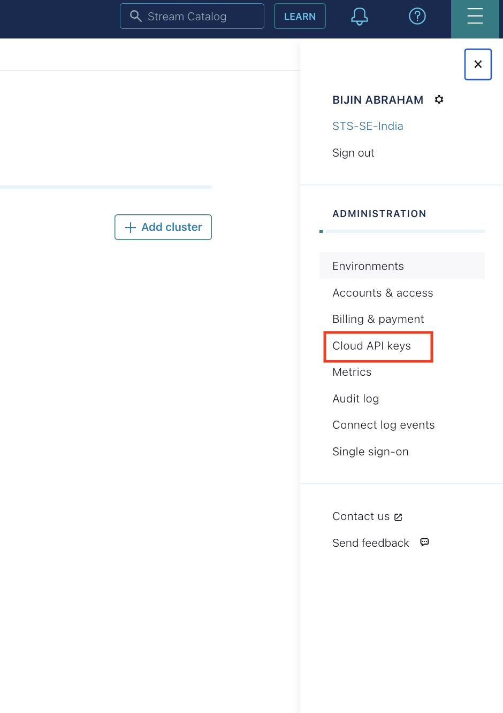
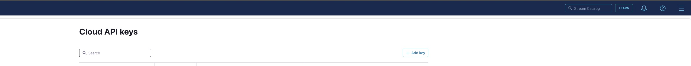
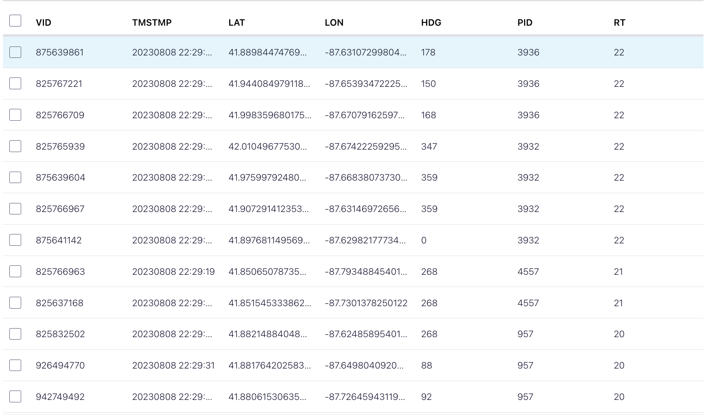
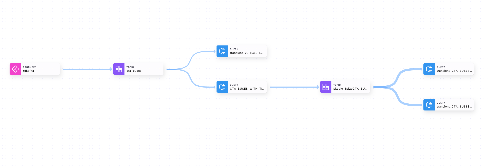

# Real-time vehicle telematics

From locomotive analytics companies tracking predictive maintenance data from their trains, to digital-native companies tracking semi-trailer trucks movement data across America’s highways, or municipalities using 100’s of buses to move people around their city. Confluent has seen it all when it comes to collecting IoT data. IoT-centric companies are struggling to collect IoT data in order to optimize fleet management, reduce operating costs, improve safety and compliance, and enhance the customer experience.

One thing remains the same – all of these companies rely on 1 too many IoT devices(commonly 1,000s to 100,000s) to collect high volumes of data to a central repository in the cloud for processing, warehousing, and delivery back to their platform applications. The hunger for consuming and delivering this real-time data has reached an all-time high. 

This demo guides you through the process of utilizing telemetry events to extract user insights using confluent kafka.

## Architecture Diagram

This demo makes use of a Python data generator script to transmit real-time IOT events from the CTA buses API to Confluent Cloud. The events are then processed through KSQLDB, where they are enriched to perform transformations on the data. The enriched data can be sent to any external system of your choice for further analysis using a connector plugin.

The Bus Tracker API allows for querying data from the CTA Bus Tracker service, with an XML document as output. The system can provide estimated arrival times for buses as they approach bus stops, as well as route, service, and vehicle location data. Information about buses and their estimated arrivals is updated about once every minute.

<div align="center"> 
  
</div>


# Requirements

In order to successfully complete this demo you need to install a few tools before getting started.

- If you don't have a Confluent Cloud account, sign up for a free trial [here](https://www.confluent.io/confluent-cloud/tryfree).
- Install Confluent Cloud CLI by following the instructions [here](https://docs.confluent.io/confluent-cli/current/install.html).
- Please follow the instructions to install Terraform if it is not already installed on your system.[here](https://developer.hashicorp.com/terraform/tutorials/aws-get-started/install-cli)  
- This demo uses Python 3.9.13 version.
- This demo uses Python modules. You can install this module through `pip`.
  ```
  pip3 install modulename
  ```

## Prerequisites

### Confluent Cloud

1. Sign up for a Confluent Cloud account [here](https://www.confluent.io/get-started/).
1. After verifying your email address, access Confluent Cloud sign-in by navigating [here](https://confluent.cloud).
1. When provided with the _username_ and _password_ prompts, fill in your credentials.

   > **Note:** If you're logging in for the first time you will see a wizard that will walk you through some tutorials. Minimize this as you will walk through these steps in this guide.

1. Create Confluent Cloud API keys by following the steps in UI. Click on the button that is present on the right top section and click on Cloud API Key.
<div align="center"> 
  
</div>

 Now Click Add Key to generate API keys and store them as we will be using that key in this demo.
 <div align="center"> 
  
</div>
    
   > **Note:** This is different than Kafka cluster API keys.

## Setup

1. This demo uses Terraform  to spin up resources that are needed.

2. Update the `terraform/variables.tf` file for the following variables with your Cloud API credentials.

```
variable "confluent_cloud_api_key" {
  
  default = " Replace with your API Key"   
}

variable "confluent_cloud_api_secret" {
  default = "Replace with your API secret"   
}
```
 ### Build your cloud infrastructure

1. Navigate to the repo's terraform directory.
   ```bash
   cd terraform
   ```

1. Initialize Terraform within the directory.
   ```
   terraform init
   ```

1. Apply the plan to create the infrastructure.

   ```
   terraform apply 
   ```

   > **Note:** Read the `main.tf` configuration file [to see what will be created](./terraform/main.tf).


 # Demo
## Execute Python Script to Generate Mock Data

Please run the Python script located in the Python script folder. Before running it, make sure to replace the below mentioned configuration settings in the code to point to the Confluent Cloud cluster that you created.
    
```
'bootstrap.servers': ''  # Replace with your Confluent Cloud bootstrap servers
'sasl.username': ''      # Replace with your Confluent Cloud API key
'sasl.password': ''      # Replace with your Confluent Cloud API secret
```
To obtain the following details, navigate to the Clients section on the Confluent Cloud UI and select Python as the script type. From there, you can copy the bootstrap server and API Key details and replace them in the code.

```
# Uses the CTA Bus Tracker API (documentation available here):
# https://www.transitchicago.com/assets/1/6/cta_Bus_Tracker_API_Developer_Guide_and_Documentation_20160929.pdf

# Given a list of Route Designators ('rt' below), return Vehicle IDs
# JSON response will be the most recent status for each vehicle

# Take that JSON response and send it to Confluent Kafka REST Proxy

import requests
import json
from configparser import ConfigParser
from ruamel.yaml import YAML
yaml = YAML()
import time
from confluent_kafka import Producer

p = Producer({
    'bootstrap.servers': '', # Replace with your Confluent Cloud bootstrap servers
    'sasl.mechanism': 'PLAIN', 
    'security.protocol': 'SASL_SSL',
    'sasl.username': '', # Replace with your Confluent Cloud API key
    'sasl.password': ''  # Replace with your Confluent Cloud API secret

})

#Topic to be used in CC 
topic = 'cta_buses'

# CTA Bus Tracker API values
api_key = '' # Replace with your CTS Bus Tracker API key
getvehicles_url = 'http://ctabustracker.com/bustime/api/v2/getvehicles'

# Format the API request and parse the response
vehicle_params = {'key': api_key, 'format': 'json', 'rt': 'X9,11,12,J14,15,18,19,20,21,22', 'tmres': 's'}

while True:
    r_vehicles = requests.get(getvehicles_url, params=vehicle_params)
    # each JSON object is the latest stats for each vehicle ID (bus).
    response_dict = r_vehicles.json()
    vehicle_dict = response_dict['bustime-response']
    list_of_vids = vehicle_dict['vehicle']


    for vid in list_of_vids:
        # each vid is a dict
        list_of_records = []
        kafka_record = {}
        kafka_record['value'] = vid
        # use the vehicle ID - vid as the key for each record
        kafka_record['key'] = vid["vid"]
        list_of_records.append(kafka_record)
        send_data = {}
        send_data['records'] = list_of_records
        send_json = json.dumps(send_data)
        print(send_json)
        p.produce(topic, key=vid["vid"], value=json.dumps(vid))
        p.poll(0)
    p.flush(10) 

    time.sleep(5)
```
Please run the Python script using the following syntax:

```
python mock_data_generator.py
```
## Enrich Data Streams with ksqlDB

Now that you have data flowing through Confluent, you can now easily build stream processing applications using ksqlDB. You are able to continuously transform, enrich, join, and aggregate your data using simple SQL syntax. You can gain value from your data directly from Confluent in real-time. Also, ksqlDB is a fully managed service within Confluent Cloud with a 99.9% uptime SLA. You can now focus on developing services and building your data pipeline while letting Confluent manage your resources for you.

<B>This Section invloves creation of KTable which provides us the real time postion of a fleet along with other fleet details for monitoring.<B>

If you’re interested in learning more about ksqlDB and the differences between streams and tables, I recommend reading these two blogs [here](https://www.confluent.io/blog/kafka-streams-tables-part-3-event-processing-fundamentals/) and [here](https://www.confluent.io/blog/how-real-time-stream-processing-works-with-ksqldb/).

1. On the navigation menu click on **ksqlDB** and step into the cluster you created during setup.
   To write streaming queries against topics, you will need to register the topics with ksqlDB as a stream or table.

2. **VERY IMPORTANT** -- at the bottom of the editor, set `auto.offset.reset` to `earliest`, or enter the statement:

   ```SQL
   SET 'auto.offset.reset' = 'earliest';
   ```

   If you use the default value of `latest`, then ksqlDB will read form the tail of the topics rather than the beginning, which means streams and tables won't have all the data you think they should.

3. Create a ksqlDB table from `cta_buses` topic.


 ```SQL
CREATE TABLE vehicle_location_table (
    VID int primary key,
    TMSTMP STRING,
    LAT double,
    LON double,
    HDG STRING,
    PID INT,
    RT STRING,
    DES STRING,
    PDIST INT,
    DLY BOOLEAN,
    TATRIPID STRING,
    ORIGTATRIPNO STRING,
    TABLOCKID STRING,
    ZONE STRING
) WITH (
    KAFKA_TOPIC='cta_buses',
    VALUE_FORMAT='JSON',
    KEY_FORMAT='KAFKA'
);

 ```
 
 
4. Use the following statement to query `vehicle_location_table` table to ensure it's being populated correctly.

```SQL
   SELECT * FROM vehicle_location_table EMIT CHANGES;
   ```
Stop the running query by clicking on **Stop**.

<div align="center"> 
  
</div>

5. Create stream `cta_buses_stream` to transform the data as needed
```SQL
CREATE STREAM cta_buses_stream (
    VID INT,
    TMSTMP STRING,
    LAT DOUBLE,
    LON DOUBLE,
    HDG INT,
    PID INT,
    RT STRING,
    DES STRING,
    PDIST INT,
    DLY BOOLEAN,
    TATRIPID STRING,
    ORIGTATRIPNO STRING,
    TABLOCKID STRING,
    ZONE STRING
) WITH (
    KAFKA_TOPIC=‘cta_buses,
    VALUE_FORMAT='JSON'
);
```
6. Create a table from stream
```SQL
CREATE STREAM VEHICLE_LOCATIONS_TABLE AS
SELECT
    CTA_BUSES_WITH_TIMESTAMP.VID AS VID,
    CTA_BUSES_WITH_TIMESTAMP.TIMESTAMP AS TIMESTAMP,
    CTA_BUSES_WITH_TIMESTAMP.LAT AS LAT,
    CTA_BUSES_WITH_TIMESTAMP.LON AS LON,
    CTA_BUSES_WITH_TIMESTAMP.HDG AS HDG,
    CTA_BUSES_WITH_TIMESTAMP.PID AS PID,
    CTA_BUSES_WITH_TIMESTAMP.RT AS RT,
    CTA_BUSES_WITH_TIMESTAMP.DES AS DES,
    CTA_BUSES_WITH_TIMESTAMP.PDIST AS PDIST,
    CTA_BUSES_WITH_TIMESTAMP.DLY AS DLY,
    CTA_BUSES_WITH_TIMESTAMP.TATRIPID AS TATRIPID,
    CTA_BUSES_WITH_TIMESTAMP.ORIGTATRIPNO AS ORIGTATRIPNO,
    CTA_BUSES_WITH_TIMESTAMP.TABLOCKID AS TABLOCKID,
    CTA_BUSES_WITH_TIMESTAMP.ZONE AS ZONE
FROM CTA_BUSES_WITH_TIMESTAMP
EMIT CHANGES;
```
## Connect External System to sink Enriched Events from  Confluent Cloud using Connector

You can create  Sink connector either through CLI or Confluent Cloud web UI.

<details>
    <summary><b>CLI</b></summary>

1. Run the following command to create the  Sink connector.

   ```bash
   confluent connect cluster create --config-file confluent/connect_config.json
   ```

**Note:** Before executing the command, substitute the connect properties with the filename that you are using.

</details>
<br>

<details>
    <summary><b>Confluent Cloud Web UI</b></summary>

1. On the navigation menu, select **Connectors** and **+ Add connector**.
1. In the search bar search for your connector and select the connector.
1. Create a new  Sink connector and complete the required fields.

</details>
<br>

Once the connector is in **Running** state navigate to your database/external system and verify messages are showing up correctly.

Refer to our [documentation](https://www.confluent.io/product/connectors/) for detailed instructions about the  connector that is available.

# Teardown

You want to delete any resources that were created during the demo so you don't incur additional charges.


## Python Script

Go back to the terminal window where the [mock_data_generator.py](./python//mock_data_generator.py) is running and quit with `Ctrl+C`.

## Infrastructure

1. Run the following command to delete all resources created by Terraform
   ```bash
   terraform apply -destory

## Confluent Cloud Stream Governance

Confluent offers data governance tools such as Stream Quality, Stream Catalog, and Stream Lineage in a package called Stream Governance. These features ensure your data is high quality, observable and discoverable. Learn more about **Stream Governance** [here](https://www.confluent.io/product/stream-governance/) and refer to the [docs](https://docs.confluent.io/cloud/current/stream-governance/overview.html) page for detailed information.

1.  Navigate to https://confluent.cloud
2.  Use the left hand-side menu and click on **Stream Lineage**.
    Stream lineage provides a graphical UI of the end to end flow of your data. Both from the a bird’s eye view and drill-down magnification for answering questions like:

    - Where did data come from?
    - Where is it going?
    - Where, when, and how was it transformed?

In our use case, the stream lineage appears as follows: we utilize a Python script to generate events that are sent to the telemetry topic. These events are sent to the monitoring tool of preference to track the vehicle in real time with the latitude and longitude


<div align="center"> 
  
</div>
   


# References

1. Connectors for Confluent Cloud [doc](https://docs.confluent.io/platform/current/connect/index.html)

2. Peering Connections in Confluent Cloud [doc](https://docs.confluent.io/cloud/current/networking/peering/index.html)
3. ksqlDB [page](https://www.confluent.io/product/ksqldb/) and [use cases](https://developer.confluent.io/tutorials/#explore-top-use-cases)
4. Stream Governance [page](https://www.confluent.io/product/stream-governance/) and [doc](https://docs.confluent.io/cloud/current/stream-governance/overview.html)

  
